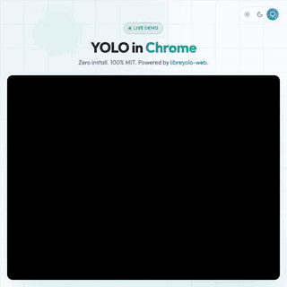

# YOLO in Chrome. Zero install. 100% MIT.



[](https://www.npmjs.com/package/libreyolo-web)
[](https://libreyolo.github.io/use-cases/chromium/)
[](../LICENSE)

Every YOLO tutorial makes you install Python, CUDA, and a small truck. We ship a single HTML file.

## Try it in 60 seconds

**Option 1: live demo** → https://libreyolo.github.io/use-cases/chromium/

**Option 2: copy the file**
```bash
curl -O https://raw.githubusercontent.com/LibreYOLO/use-cases/main/chromium/index.html
open index.html   # or just double-click it
```

That's it. The model auto-downloads from HuggingFace on first run (~3.6 MB) and runs entirely in your browser. No server, no Python, no install.

## What it does

- Real-time object detection on your webcam in Chrome, Edge, or any other Chromium browser.
- WebGPU acceleration when available, WASM fallback otherwise. Both shipped by [`libreyolo-web`](https://github.com/LibreYOLO/libreyolo-web).
- Auto-downloads `LibreYOLOXn` (3.6 MB) from HuggingFace, auto-detects the model family.
- 100% MIT. Use it for anything, including commercial work.

## FAQ

**Does it work offline?** Yes after first load. The model and runtime are cached by the browser. The first visit needs internet to fetch the JS from esm.sh and the ONNX from HuggingFace.

**Can I use my own model?** Yes. Replace `loadModel('LibreYOLOXn')` with `loadModel('./my_model.onnx', { modelFamily: 'yolox', inputSize: 640 })`. Supported families: `yolo`, `yolox`, `yolo9`, `rfdetr`. See the [libreyolo-web docs](https://github.com/LibreYOLO/libreyolo-web).

**Is this really MIT?** Yes. No AGPL, no commercial license, no upgrade path that locks you in. The model weights, the inference library, and this demo are all MIT.

**How big is the bundle?** The HTML file is under 4 KB. `libreyolo-web` and `onnxruntime-web` are loaded from esm.sh on demand (~1 MB total runtime, gzipped). The smallest YOLO model is 3.6 MB.

**Why not TensorFlow.js?** ONNX Runtime gives you a single model format that works in Python, Node, and the browser. Train once, deploy anywhere. TF.js requires its own conversion path and doesn't cover transformer-style detectors like RF-DETR.

## Credits

Built on [libreyolo-web](https://github.com/LibreYOLO/libreyolo-web) by [LibreYOLO](https://github.com/LibreYOLO). MIT licensed. No AGPL.
